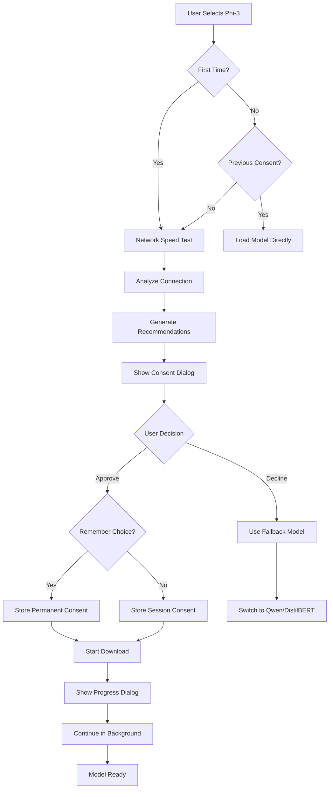

# ✅ User Consent Flow

## **Overview**

The Interactive CV Platform implements an intelligent consent system that balances user experience with informed decision-making. The system only requests consent when necessary and provides comprehensive information to help users make the best choice for their situation.

## **Consent Philosophy**

### **Core Principles**
1. **Informed Consent**: Users see real network speed and download estimates
2. **One-Time Decision**: Ask once, remember forever (unless user changes preference)
3. **Progressive Enhancement**: Start with basic functionality, upgrade on consent
4. **Transparent Process**: Clear information about what's being downloaded and why
5. **User Control**: Easy to decline or change preferences later

## **When Consent is Required**

### **Consent Triggers**
- **First-time Phi-3 selection**: User manually selects Phi-3 from dropdown
- **New browser session**: If user didn't check "Remember my choice"
- **Cleared browser data**: When localStorage is reset
- **Model upgrade request**: When switching from smaller to larger model

### **No Consent Required**
- **Background preloading**: Happens silently for optimization
- **Smaller models**: DistilBERT and Qwen load without prompting
- **Already approved**: When user previously gave consent
- **Model downgrade**: Switching from larger to smaller model

## **Consent Flow Diagram**



## **Consent Dialog Components**

### **1. Network Analysis Section**
The dialog begins with real-time network analysis:

```javascript
// Network speed detection
const networkInfo = await detectNetworkSpeed();
const estimate = getDownloadEstimate(1.8, networkInfo.speed);

// Results displayed to user
Connection Speed: 25.3 Mbps
Estimated Time: 8-12 minutes  
Recommendation: Good for download
```

#### **Speed Test Process**
1. Downloads small test file from HuggingFace CDN
2. Measures actual transfer speed
3. Calculates realistic time estimate for 1.8GB
4. Provides connection-specific recommendations

### **2. Model Information Section**
Clear details about what's being downloaded:

```
🧠 Phi-3 Advanced AI
Enhanced conversational intelligence for your CV

📊 Download Information
• Size: ~1.8GB
• Connection Speed: 25.3 Mbps  
• Estimated Time: 8-12 minutes
• One-time download (cached for future use)
```

### **3. Benefits Section**
Explains why the upgrade is valuable:

```
⚡ What You'll Get
• Advanced conversational AI
• Professional-quality responses  
• Better understanding of context
• More detailed explanations
```

### **4. Requirements Section**
Technical requirements clearly stated:

```
🔧 Requirements
• 4GB RAM
• Desktop browser recommended
• WebGPU support (Chrome/Edge)
```

### **5. Connection Warning (When Applicable)**
Appears for slow connections (<2 Mbps):

```
⚠️ Connection Warning
Slow connection detected (1.2 Mbps). Download may take 45+ minutes.

💡 Recommendations: Switch to WiFi, use a faster connection, 
or try the lighter Qwen model instead.
```

## **Consent Dialog Variations**

### **Fast Connection (>10 Mbps)**
```html
<div class="consent-dialog optimal">
  <h2>🧠 Phi-3 Advanced AI</h2>
  <div class="network-info good">
    <strong>Connection:</strong> 25.3 Mbps ✅
    <strong>Estimated Time:</strong> 8-12 minutes
    <strong>Status:</strong> Optimal for download
  </div>
  <!-- Standard benefits and requirements -->
  <button class="approve primary">Download Phi-3 🚀</button>
</div>
```

### **Moderate Connection (2-10 Mbps)**
```html
<div class="consent-dialog moderate">
  <h2>🧠 Phi-3 Advanced AI</h2>
  <div class="network-info warning">
    <strong>Connection:</strong> 4.1 Mbps ⚠️
    <strong>Estimated Time:</strong> 25-35 minutes  
    <strong>Status:</strong> Download will take time
  </div>
  <div class="tip">
    💡 Consider using WiFi for faster download
  </div>
  <button class="approve secondary">Download Anyway</button>
</div>
```

### **Slow Connection (<2 Mbps)**
```html
<div class="consent-dialog slow">
  <h2>🧠 Phi-3 Advanced AI</h2>
  <div class="network-info danger">
    <strong>Connection:</strong> 1.2 Mbps ❌
    <strong>Estimated Time:</strong> 60+ minutes
    <strong>Status:</strong> Very slow connection
  </div>
  <div class="warning">
    ⚠️ We recommend using the lighter Qwen model instead
  </div>
  <button class="approve danger">Download Despite Slow Connection</button>
  <button class="alternative">Try Qwen Instead (500MB)</button>
</div>
```

## **Progress Tracking System**

### **Progress Dialog**
After user approves, the consent dialog transforms into a progress tracker:

```html
<div class="progress-dialog">
  <h2>🧠 Downloading Phi-3</h2>
  
  <div class="progress-bar-container">
    <div class="progress-bar" style="width: 45%"></div>
  </div>
  
  <div class="progress-stats">
    <span class="percentage">45%</span>
    <span class="speed">12.3 MB/s</span>
    <span class="time-remaining">3m 42s remaining</span>
  </div>
  
  <div class="tip">
    💡 You can continue using the app while this downloads
  </div>
  
  <button class="continue-background">Continue in Background</button>
</div>
```

### **In-Conversation Progress**
When user switches back to Phi-3 during download, progress appears in the conversation area:

```html
<div class="conversation-progress">
  <strong>🧠 Phi-3 Advanced is downloading...</strong>
  
  <div class="mini-progress-bar">
    <div class="fill" style="width: 67%"></div>
  </div>
  
  <div class="progress-details">
    <span>67%</span>
    <span>8.4 MB/s</span>
    <span>2m left</span>
  </div>
  
  <div class="tip">
    💡 You can continue chatting with other models while this downloads
  </div>
</div>
```

## **State Management**

### **Consent Storage Strategy**
```javascript
// Permanent consent (Remember checkbox checked)
localStorage.setItem('phi3_model_consent_phi3', 'approved');

// Session approval (Remember checkbox unchecked)  
localStorage.setItem('phi3_download_state_phi3', 'user_approved');

// User can clear consent
function clearDownloadState(modelKey) {
  localStorage.removeItem(`phi3_model_consent_${modelKey}`);
  localStorage.removeItem(`phi3_download_state_${modelKey}`);
}
```

### **Decision Logic**
```javascript
async function shouldShowConsentDialog(modelKey) {
  // Never show if permanent consent given
  if (hasUserConsentFor(modelKey)) return false;
  
  // Never show if model already loaded
  if (window.aiModels?.[modelKey]) return false;
  
  // Show for first-time users
  return !hasUserApprovedDownload(modelKey);
}
```

## **User Experience Scenarios**

### **Scenario 1: First-Time Fast Connection User**
1. User selects Phi-3 from dropdown
2. System detects 50 Mbps connection
3. Shows consent dialog with "Optimal for download" status
4. User approves → Download starts immediately
5. Progress dialog shows 5-8 minute estimate
6. User clicks "Continue in Background"
7. Returns to conversation, sees Qwen is active
8. Switches back to Phi-3 later → Shows conversation progress
9. Download completes → Auto-switches to Phi-3

### **Scenario 2: Slow Connection User**
1. User selects Phi-3 from dropdown  
2. System detects 1.5 Mbps connection
3. Shows consent dialog with warning about 60+ minute download
4. Provides "Try Qwen Instead" option
5. User chooses Qwen → Immediate switch, no download needed
6. Gets good conversational experience with 500MB model

### **Scenario 3: Returning User**
1. User previously approved Phi-3 with "Remember" checked
2. New browser session → No consent dialog
3. System automatically uses Phi-3 if available
4. Or starts download silently in background

### **Scenario 4: Mobile User**
1. User selects Phi-3 from dropdown
2. System detects mobile device
3. Shows different dialog explaining Phi-3 isn't optimized for mobile
4. Recommends Qwen or DistilBERT instead
5. User can still force download if desired

## **Error Handling & Recovery**

### **Download Failures**
```javascript
// Network error during download
catch (error) {
  showRecoveryDialog({
    title: "Download Interrupted",
    message: "Network error occurred. Try again?",
    options: ["Retry Phi-3", "Use Qwen Instead", "Use DistilBERT"]
  });
}
```

### **Browser Compatibility Issues**
```javascript
// WebGPU not available
if (!hasWebGPUSupport() && modelKey === 'phi3') {
  showCompatibilityWarning({
    title: "Limited Browser Support", 
    message: "Phi-3 works best with Chrome/Edge. Continue with slower performance?",
    options: ["Continue Anyway", "Use Qwen Instead"]
  });
}
```

### **Memory Limitations**
```javascript
// Insufficient RAM detected
if (getDeviceMemoryGB() < 4 && modelKey === 'phi3') {
  showMemoryWarning({
    title: "Memory Limitation",
    message: "Your device may not have enough RAM for optimal Phi-3 performance.",
    options: ["Try Anyway", "Use Qwen (Recommended)"]
  });
}
```

## **Analytics & Optimization**

### **Consent Metrics** (Privacy-Focused)
The system could track (without personal data):
- Consent approval/decline rates by connection speed
- Most common fallback model choices
- Average download completion rates
- User satisfaction with model recommendations

### **A/B Testing Opportunities**
- Different consent dialog designs
- Various warning thresholds for slow connections  
- Alternative model recommendation strategies
- Progress dialog UX variations

## **Privacy & Security**

### **Data Protection**
- **No Personal Data Stored**: Only model preferences in localStorage
- **No Tracking**: No user behavior analytics or external tracking
- **Local Storage Only**: All consent data stays on user's device
- **User Control**: Easy to clear all consent data

### **Security Measures**
- **HTTPS Only**: All model downloads over secure connections
- **Integrity Verification**: Model files validated during download
- **Sandboxed Execution**: AI models run in isolated browser context
- **No External Dependencies**: Consent system is fully client-side

This consent system ensures users make informed decisions while maintaining the highest standards of privacy and user experience.