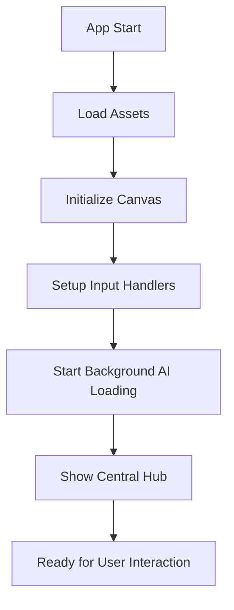
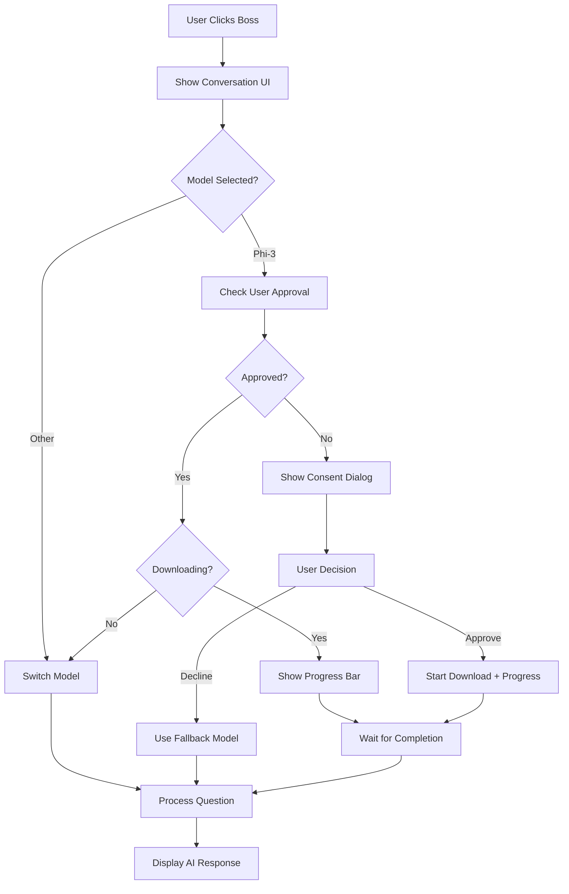

# 🏗️ System Architecture Overview

## **High-Level Architecture**

The Interactive CV Platform is built as a client-side application with a modular, scalable architecture that separates concerns across distinct layers.

```
┌─────────────────────────────────────────────────────────────────────┐
│                           Browser Layer                             │
├─────────────────────────────────────────────────────────────────────┤
│  🎮 Game Engine    │  🤖 AI System     │  🎨 UI Components          │
│  • Canvas Manager  │  • Model Manager  │  • GameBoy Interface      │
│  • Input Handler   │  • Network Test   │  • Conversation UI        │
│  • Render Engine   │  • Progress Track │  • Mobile Controls        │
├─────────────────────────────────────────────────────────────────────┤
│                        Core Services Layer                          │
│  📁 Room Manager   │  💾 State Manager │  🔧 Device Detection      │
│  • Navigation      │  • Local Storage  │  • Capability Check       │
│  • Transitions     │  • Session State  │  • Browser Support        │
├─────────────────────────────────────────────────────────────────────┤
│                         Data Layer                                  │
│  🧠 AI Models      │  📊 User Data     │  ⚙️ Configuration         │
│  • Transformers.js│  • CV Content     │  • Model Settings         │
│  • ONNX Runtime   │  • User Prefs     │  • Network Policies       │
└─────────────────────────────────────────────────────────────────────┘
```

## **Core Components**

### **1. Game Engine (`src/main.ts`, `src/modules/canvas.ts`)**
The foundation that handles:
- **Canvas Management**: HTML5 Canvas rendering and lifecycle
- **Game Loop**: 60fps animation loop with delta time
- **Asset Loading**: Sprite sheets, tiles, and image resources
- **Coordinate System**: Tile-based positioning (64x64px tiles)

### **2. Room Management (`src/modules/roomManager.ts`)**
Handles navigation between different areas:
- **Central Hub**: Starting area with navigation options
- **Boss Room**: Main interaction area with AI conversation
- **Data Science Room**: Technical skills showcase
- **R&D Room**: Engineering experience display
- **Smooth Transitions**: Fade in/out between rooms

### **3. AI Processing System (`src/modules/aiProcessor.ts`)**
The brain of the application:

#### **Model Management**
```typescript
interface AIModel {
  name: string;           // HuggingFace model identifier
  description: string;    // User-friendly description
  size: string;          // Download size (e.g., "1.8GB")
  type: "qa" | "chat";   // Model capability type
  minMemoryGB: number;   // Required device memory
  recommendedWebGPU: boolean;
}
```

#### **Three-Tier Model System**
- **DistilBERT Q&A** (65MB): Fast question-answering for basic devices
- **Qwen Chat** (500MB): Conversational AI for mid-range devices  
- **Phi-3 Advanced** (1.8GB): State-of-the-art responses for high-end devices

#### **Device Capability Detection**
```typescript
function getBestModelForDevice(): string {
  const memory = getDeviceMemoryGB();
  const hasWebGPU = hasWebGPUSupport();
  const isMobile = isMobileDevice();
  
  if (!isMobile && memory >= 4 && hasWebGPU) return 'phi3';
  if (memory >= 2) return 'qwen';
  return 'distilbert';
}
```

### **4. Network Intelligence (`src/modules/networkDetection.ts`)**
Analyzes user's connection:
- **Speed Testing**: Downloads test file to measure real bandwidth
- **Connection API**: Uses `navigator.connection` when available
- **Intelligent Warnings**: Suggests better connection for large models
- **Time Estimation**: Calculates accurate download times

### **5. User Consent System (`src/modules/modelConsent.ts`)**
Manages large model downloads:
- **One-Time Decision**: User decides once, system remembers
- **Progressive Enhancement**: Starts with basic model, upgrades on consent
- **Real-Time Progress**: Live download tracking with speed/time remaining
- **Graceful Degradation**: Falls back to smaller models on slow connections

### **6. Conversation Interface (`src/modules/gameboyConversation.ts`)**
GameBoy-style chat system:
- **Retro UI**: Pixel-perfect GameBoy aesthetic
- **Model Selector**: Dropdown to switch between AI models
- **Progress Integration**: Shows download progress inline
- **Mobile-Friendly**: Touch-optimized for all devices

## **Data Flow Architecture**

### **Application Startup**


### **AI Conversation Flow**


### **State Management Strategy**

#### **Local Storage Persistence**
```typescript
// User preferences persist across sessions
localStorage.setItem('phi3_model_consent_phi3', 'approved');
localStorage.setItem('phi3_download_state_phi3', 'user_approved');
```

#### **Session State Management**
```typescript
// In-memory state for current session
let modelDownloadState: { [key: string]: DownloadState } = {};
let userRequestedModels: Set<string> = new Set();
let preloadedModels: { [key: string]: ModelPipeline } = {};
```

#### **Background vs User-Requested Downloads**
- **Background Loading**: Silent, no UI impact, for optimization
- **User Downloads**: Explicit consent, progress tracking, UI integration

## **Performance Optimizations**

### **Background Model Preloading**
```typescript
// Intelligent preloading based on device capabilities
const bestModel = getBestModelForDevice();
if (bestModel === 'phi3') {
  // High-end: Load Phi-3 + Qwen backup
} else if (bestModel === 'qwen') {
  // Mid-range: Load Qwen + DistilBERT backup
} else {
  // Low-end: Load DistilBERT only
}
```

### **Progressive Model Loading**
1. **App starts**: Background loads recommended model
2. **User interaction**: Consent system for upgrades
3. **Fallback system**: Always maintains working AI

### **Memory Management**
- **Model Unloading**: Releases memory when switching models
- **Garbage Collection**: Proactive cleanup of unused resources
- **Progress Tracking**: Monitors download progress and memory usage

## **Cross-Platform Compatibility**

### **Browser Support Matrix**
| Feature | Chrome | Firefox | Safari | Edge |
|---------|---------|---------|--------|------|
| WebGPU | ✅ Full | ⚠️ Limited | ❌ None | ✅ Full |
| WASM | ✅ Yes | ✅ Yes | ✅ Yes | ✅ Yes |
| File API | ✅ Yes | ✅ Yes | ⚠️ Limited | ✅ Yes |
| Network Info | ✅ Yes | ❌ No | ❌ No | ✅ Yes |

### **Responsive Design Strategy**
```css
/* Mobile-first approach */
@media (max-width: 768px) {
  /* Touch controls, vertical layout */
}

@media (min-width: 769px) {
  /* Keyboard shortcuts, horizontal layout */
}
```

### **iOS Safari Fallback System**
```typescript
if (isIOSDevice()) {
  // Bypass Transformers.js entirely
  return generateIOSFallbackResponse(question);
}
```

## **Security & Privacy**

### **Client-Side Only Architecture**
- **No Server Required**: Everything runs in the browser
- **Data Privacy**: CV content never leaves the user's device
- **No Tracking**: No analytics or user behavior monitoring
- **Offline Capable**: Works without internet after initial load

### **Model Loading Security**
- **HTTPS Only**: All model downloads over secure connections
- **Integrity Checks**: Validates model files during download
- **Sandboxed Execution**: Models run in isolated browser context
- **No Code Injection**: No eval() or dynamic code execution

## **Deployment Architecture**

### **Static Site Generation**
```bash
npm run build  # Generates optimized static files
├── dist/
│   ├── index.html
│   ├── assets/
│   │   ├── main-[hash].js
│   │   ├── style-[hash].css
│   │   └── [images]
│   └── [other static files]
```

### **CDN Integration**
- **Transformers.js**: Loaded from CDN for caching benefits
- **Model Files**: Downloaded from HuggingFace CDN
- **Assets**: Bundled and served from static host

### **Hosting Options**
- **GitHub Pages**: Free, integrated with repository
- **Netlify/Vercel**: Enhanced performance and features
- **Any Static Host**: Works on any web server

## **Error Handling & Resilience**

### **Graceful Degradation Hierarchy**
1. **Ideal**: Phi-3 with WebGPU acceleration
2. **Good**: Qwen with WASM fallback
3. **Basic**: DistilBERT for all devices
4. **Fallback**: Pre-written responses for iOS/unsupported browsers

### **Error Recovery Strategies**
```typescript
// Model loading failure recovery
try {
  await loadModel('phi3');
} catch (error) {
  console.warn('Phi-3 failed, trying Qwen...');
  await loadModel('qwen');
} catch (error) {
  console.warn('Qwen failed, using DistilBERT...');
  await loadModel('distilbert');
}
```

## **Future Architecture Considerations**

### **Planned Enhancements**
- **WebWorker Integration**: Offload AI processing to background threads
- **ServiceWorker Caching**: Offline model storage and management
- **IndexedDB Storage**: Persistent model caching across sessions
- **WebRTC Integration**: Peer-to-peer model sharing
- **WebAssembly Optimization**: Custom WASM modules for performance

### **Scalability Design**
The modular architecture supports easy addition of:
- New AI models and providers
- Additional room types and interactions
- Extended device capability detection
- Enhanced user interface components
- Advanced analytics and monitoring

This architecture ensures the platform can evolve while maintaining performance, compatibility, and user experience across all supported devices and browsers.