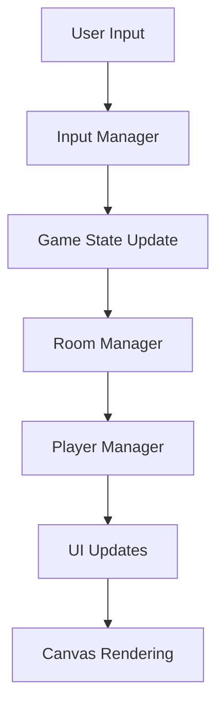
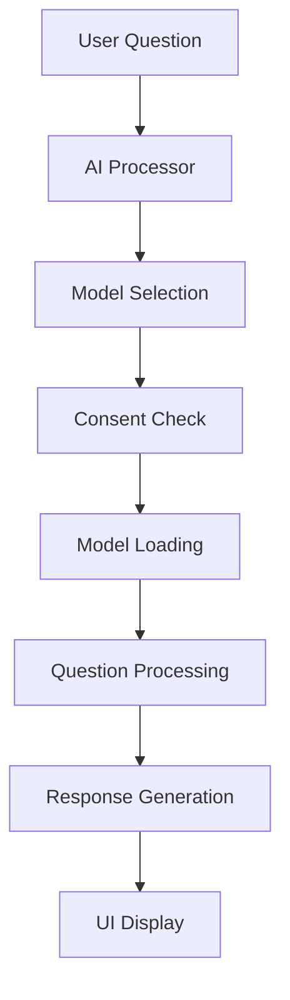

# 📁 Code Organization & Structure

## **Project Overview**

The Interactive CV Platform follows a modular architecture with clear separation of concerns. This document explains how the codebase is organized and the patterns used throughout the project.

## **Directory Structure**

```
MyImmersiveExperience/
├── 📄 index.html              # Entry point with HTML structure
├── 🎨 style.css              # Global styles and GameBoy theme
├── ⚙️ main.ts                # Application entry point and game loop
├── 🔧 vite.config.js         # Vite build configuration
├── 📦 package.json           # Dependencies and scripts
├── 🚀 deploy.sh              # Deployment automation script
│
├── 📂 src/                   # Main source code directory
│   ├── 📂 modules/          # Core application modules
│   │   ├── 🎮 canvas.ts         # Canvas management and rendering
│   │   ├── 🏠 roomManager.ts    # Room navigation and state
│   │   ├── 👤 playerManager.ts  # Player movement and sprites
│   │   ├── 🎯 inputManager.ts   # Input handling (keyboard/touch)
│   │   ├── 🎨 ui.ts             # UI components and interactions
│   │   ├── 🤖 aiProcessor.ts    # AI models and processing
│   │   ├── 💬 gameboyConversation.ts  # Chat interface
│   │   ├── ✅ modelConsent.ts   # User consent management
│   │   ├── 📶 networkDetection.ts    # Network speed testing
│   │   ├── 🖥️ desktopControls.ts     # Desktop-specific features
│   │   └── 🐛 debug.ts          # Development debugging tools
│   │
│   └── 📂 types/            # TypeScript type definitions
│       └── 📝 index.ts          # Shared interfaces and types
│
├── 📂 assets/               # Static assets
│   ├── 📂 images/              # Sprite sheets and textures
│   ├── 📂 audio/               # Sound effects (future)
│   └── 📄 assets_metadata.json # Asset configuration
│
└── 📂 docs/                 # Documentation
    ├── 📂 architecture/        # System design docs
    ├── 📂 ai-system/          # AI-specific documentation
    ├── 📂 development/        # Developer guides
    ├── 📂 user-guide/         # User documentation
    └── 📂 design/             # Design system docs
```

## **Module Responsibilities**

### **Core Engine Modules**

#### **`main.ts`** - Application Bootstrap
- **Purpose**: Entry point, game loop, and high-level coordination
- **Key Functions**:
  - `startGame()`: Initializes canvas, assets, and modules
  - `gameLoop()`: 60fps animation loop with delta time
  - `loadAssets()`: Preloads sprites and configuration
- **Dependencies**: All core modules
- **State Management**: Global application state

#### **`canvas.ts`** - Rendering Engine
- **Purpose**: Canvas management, drawing operations, coordinate systems
- **Key Functions**:
  - `initCanvas()`: Canvas setup and context configuration
  - `clearCanvas()`: Frame clearing with GameBoy green background
  - `drawSprite()`: Sprite rendering with position and frame
- **Patterns**: Singleton pattern for canvas context
- **Coordinate System**: Tile-based (64x64px tiles)

#### **`roomManager.ts`** - Scene Management
- **Purpose**: Handles different game areas and transitions
- **Key Functions**:
  - `switchToRoom()`: Room navigation with fade transitions
  - `getCurrentRoom()`: Current room state getter
  - `updateRoomState()`: Room-specific update logic
- **Room Types**: Central hub, boss room, data science room, R&D room
- **State Pattern**: Different behaviors per room type

### **Game Logic Modules**

#### **`playerManager.ts`** - Character Control
- **Purpose**: Player movement, animation, and sprite management
- **Key Functions**:
  - `updatePlayerPosition()`: Movement with collision detection
  - `animatePlayer()`: Sprite animation state machine
  - `handlePlayerInput()`: Input processing and response
- **Animation States**: `idle`, `walk` with directional variants
- **Data Structures**: Player position, direction, animation frame

#### **`inputManager.ts`** - Input Abstraction
- **Purpose**: Unified input handling for keyboard and touch
- **Key Functions**:
  - `initInputHandlers()`: Event listener setup
  - `handleKeyPress()`: Keyboard input processing
  - `handleTouchInput()`: Mobile touch control handling
- **Event System**: Custom event dispatching for game actions
- **Cross-Platform**: Keyboard + touch input support

### **AI System Modules**

#### **`aiProcessor.ts`** - AI Core
- **Purpose**: Multi-model AI system with intelligent selection
- **Key Functions**:
  - `loadBestAvailableModel()`: Device-based model selection
  - `processQuestion()`: Unified AI query interface
  - `getBestModelForDevice()`: Capability detection algorithm
- **Model Management**: Three-tier system (DistilBERT, Qwen, Phi-3)
- **Fallback Chain**: Graceful degradation on device limitations

#### **`modelConsent.ts`** - User Consent
- **Purpose**: User approval system for large model downloads
- **Key Functions**:
  - `requestModelConsent()`: Consent dialog with network analysis
  - `hasUserConsentFor()`: Consent state checking
  - `showDownloadProgress()`: Real-time progress tracking
- **Storage**: localStorage for persistent consent
- **UX Pattern**: One-time decision with clear benefits explanation

#### **`networkDetection.ts`** - Connection Analysis
- **Purpose**: Network speed testing and download estimation
- **Key Functions**:
  - `detectNetworkSpeed()`: Real bandwidth measurement
  - `getDownloadEstimate()`: Time calculation for model sizes
  - `shouldWarnSlowConnection()`: User experience optimization
- **Testing Method**: Downloads sample files from HuggingFace CDN
- **Fallbacks**: Connection API when available, speed tests otherwise

### **UI & Interaction Modules**

#### **`gameboyConversation.ts`** - Chat Interface
- **Purpose**: GameBoy-style conversation system with AI integration
- **Key Functions**:
  - `initConversationUI()`: Chat interface setup
  - `processUserMessage()`: Message handling and AI routing
  - `showModelSelector()`: Dynamic model switching interface
- **UI Pattern**: Terminal-style chat with retro aesthetics
- **Integration**: Connects UI events to AI processing pipeline

#### **`ui.ts`** - General UI Components
- **Purpose**: Shared UI components and interaction handlers
- **Key Functions**:
  - `showModal()`: Modal dialog system
  - `updateProgressBar()`: Progress indication components
  - `createButton()`: Consistent button styling
- **Design System**: GameBoy-inspired color palette and typography
- **Responsive**: Mobile-first with desktop enhancements

#### **`desktopControls.ts`** - Desktop Features
- **Purpose**: Desktop-specific functionality and optimizations
- **Key Functions**:
  - `initDesktopControls()`: Keyboard shortcuts and hints
  - `toggleTouchControls()`: Hide mobile UI on desktop
  - `isDesktopDevice()`: Device type detection
- **Progressive Enhancement**: Adds features for capable devices
- **UX Pattern**: Contextual controls based on device capabilities

## **Design Patterns & Architecture**

### **Module Pattern**
Each module exports a focused set of functions with clear responsibilities:

```typescript
// Example module structure
export interface ModuleInterface {
  init(): void;
  update(deltaTime: number): void;
  cleanup(): void;
}

// Internal state is private to the module
let internalState = {};

export function publicFunction() {
  // Module implementation
}
```

### **Observer Pattern**
Event-driven communication between modules:

```typescript
// Event system for loose coupling
document.addEventListener('roomChanged', (event) => {
  // React to room changes
});

document.dispatchEvent(new CustomEvent('playerMoved', {
  detail: { x: playerX, y: playerY }
}));
```

### **Strategy Pattern**
Different AI models implement the same interface:

```typescript
interface AIModel {
  process(question: string): Promise<string>;
  getModelInfo(): ModelInfo;
}

// Different strategies for different models
const modelStrategies = {
  distilbert: new DistilBERTStrategy(),
  qwen: new QwenStrategy(),
  phi3: new Phi3Strategy()
};
```

### **State Pattern**
Room behavior varies based on current state:

```typescript
abstract class Room {
  abstract update(deltaTime: number): void;
  abstract handleInput(input: InputEvent): void;
  abstract render(ctx: CanvasRenderingContext2D): void;
}

class BossRoom extends Room {
  // Boss-specific behavior
}
```

## **Data Flow Architecture**

### **Unidirectional Data Flow**


### **AI Processing Pipeline**


## **Coding Conventions**

### **TypeScript Patterns**

#### **Interface Definitions**
```typescript
// Clear interface contracts
interface Player {
  x: number;
  y: number;
  direction: Direction;
  animationState: AnimationState;
  currentFrame: number;
}

// Enum for constants
enum Direction {
  UP = 'up',
  DOWN = 'down',
  LEFT = 'left', 
  RIGHT = 'right'
}
```

#### **Function Signatures**
```typescript
// Clear parameter types and return values
async function loadModel(
  modelKey: string, 
  progressCallback?: (progress: number) => void
): Promise<ModelPipeline> {
  // Implementation
}

// Optional parameters with defaults
function drawSprite(
  ctx: CanvasRenderingContext2D,
  sprite: HTMLImageElement,
  x: number,
  y: number,
  frame: number = 0
): void {
  // Implementation
}
```

### **Naming Conventions**

#### **Files and Modules**
- **camelCase**: `playerManager.ts`, `aiProcessor.ts`
- **Descriptive**: Names clearly indicate module purpose
- **Consistent**: All modules follow same naming pattern

#### **Functions and Variables**
- **camelCase**: `updatePlayerPosition`, `getCurrentRoom`
- **Verbs for functions**: `calculateDistance`, `renderSprite`
- **Nouns for variables**: `playerPosition`, `currentRoom`
- **Boolean flags**: `isLoading`, `hasConsent`, `canUpgrade`

#### **Constants and Types**
- **UPPER_CASE**: `const MAX_PLAYERS = 4`
- **PascalCase for types**: `interface Player`, `enum Direction`
- **Descriptive**: `AI_MODELS`, `CANVAS_CONFIG`

### **File Organization**

#### **Import/Export Patterns**
```typescript
// Named exports for utilities
export { initCanvas, clearCanvas, drawSprite } from './canvas';

// Default export for main module interface
export default class RoomManager {
  // Class implementation
}

// Grouped imports
import { 
  updatePlayerPosition, 
  animatePlayer, 
  handlePlayerInput 
} from './playerManager';
```

#### **Module Structure**
```typescript
// 1. Imports
import { SomeType } from './types';

// 2. Type definitions
interface LocalInterface {
  // Local types
}

// 3. Constants
const MODULE_CONFIG = {
  // Configuration
};

// 4. Private state
let privateState = {};

// 5. Private functions
function privateHelper() {
  // Internal logic
}

// 6. Public exports
export function publicFunction() {
  // Public interface
}
```

## **Error Handling Patterns**

### **Graceful Degradation**
```typescript
try {
  const result = await tryAdvancedFeature();
  return result;
} catch (error) {
  console.warn('Advanced feature failed, using fallback:', error);
  return fallbackImplementation();
}
```

### **User-Friendly Error Messages**
```typescript
function handleError(error: Error, context: string): void {
  // Log technical details for developers
  console.error(`[${context}] Technical error:`, error);
  
  // Show user-friendly message
  showUserMessage('Something went wrong. Please try again.');
  
  // Attempt recovery
  attemptRecovery(context);
}
```

## **Testing Strategies**

### **Manual Testing Points**
- **Cross-browser compatibility**: Test all major browsers
- **Device responsiveness**: Mobile, tablet, desktop layouts
- **Network conditions**: Fast, slow, offline scenarios
- **User flows**: Complete conversation workflows
- **Error scenarios**: Model loading failures, network issues

### **Development Workflow**
1. **Local Development**: `npm run dev` with hot reload
2. **Build Testing**: `npm run build` and `npm run preview`
3. **Cross-browser Testing**: Manual testing across browsers
4. **Deployment**: `npm run deploy` to GitHub Pages

This code organization ensures maintainability, scalability, and clear separation of concerns throughout the Interactive CV Platform.